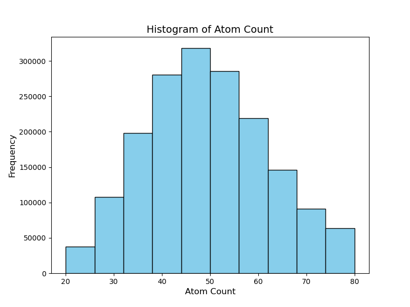
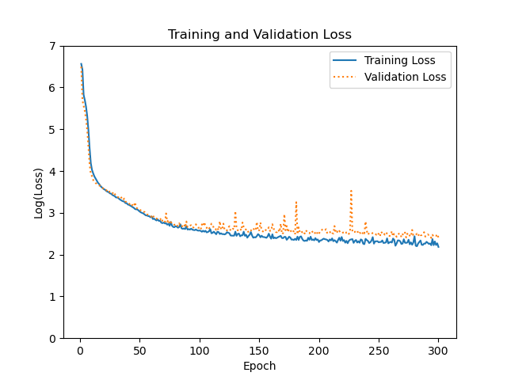
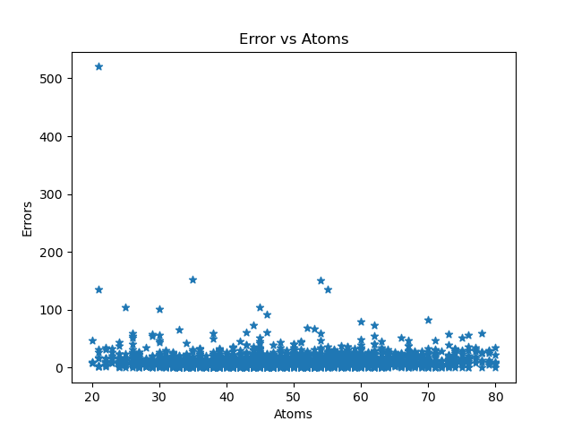

In this project we are using Multilayered Perceptron network to model single point energies of molecules calculated with the help of Density Functional Theory(DFT)

DFT can be used to calculate the value of the potential energy of a molecule. This value is called single point energy. It can be understood as a point in the potential energy surface of the molecule. Doing DFT calculations is computationally expensive and with the the advent of Machine Learning methods, we could train ML models to learn/simulate DFT models as closely as possible. For this we take the simplest quantity to model using ML, the ground state energy of a molecule. 

## Input of the Model
One of the problems in using machine learning techniques in finding properties of molecules is to
characterize the molecule uniquely in a way that we can feed into a machine learning model. The method we have chosen in this project to perform that description is using Coulomb matrices which was presented in this paper https://journals.aps.org/prl/abstract/10.1103/PhysRevLett.108.058301.
The entries of coulomb matrix are defined as:

$$
C_{ij} =
\begin{cases}
0.5Z_i^{2.4}, & i = j \\
\frac{Z_i Z_j}{||R_i - R_j||}, & i \neq j
\end{cases}
$$

where $$Z_i, Z_j$$ are atomic numbers, and $$R_i, R_j$$ are atomic positions in 3D space. The diagonal elements represent nuclear charge energy, while off-diagonal elements represent interatomic repulsion.However since not all the molecules in the input space will be of equal size, we need to pad the coulomb matrix with zeros so that the inputs are all of equal size. Thus an input sample during training
will be:

$$
\begin{bmatrix}
x_{1,1} & x_{1,2} & \cdots & x_{1,n} & \cdots & 0 \\
x_{2,1} & x_{2,2} & \cdots & x_{2,n} & \cdots & 0 \\
\vdots  & \vdots  & \ddots & \vdots  & \cdots & \vdots \\
x_{n,1} & x_{n,2} & \cdots & x_{n,n} & \cdots & 0 \\
\vdots  & \vdots  & \vdots & \vdots  & \ddots & \vdots \\
0 & 0 & \cdots & \cdots & \cdots & 0
\end{bmatrix}
$$

## Invariance of Input
For any input representation scheme to be used on a molecule, the representation must be invariant to
translation, rotation, permutation of the atoms in the molecule

1. Translation Invariance: Shifting a molecule in space does not change distances between atoms, ensuring $$ C_{ij} $$ remains unchanged.
2. Rotational Invariance: Since rotations also preserve interatomic distances, the Coulomb matrix remains invariant under rotation.
3. Permutation Invariance: Different atom orderings can produce different matrices. To standardize, we sort atoms by atomic number and then by distance from the molecular center of mass.

## Output of the Model
The model outputs single point energy of a given input molecule. Single point energy means the potential
energy of the molecule at a given state. The model was trained on energy calculated using Gaussian 09
software. The output space during training will be of the form:

$$
E = \begin{bmatrix} E_1, E_2, \dots, E_n \end{bmatrix}
$$

where each $$E_i$$ corresponds to the energy of a specific molecule in the dataset. The Gaussian program outputs the energies in the
unit of Hatrees which is related to eV by 1 Hatree = 27.211 eV


## Data Preprocessing

## Data Extraction 
The molecular information is taken from chembl website, by selecting their small compounds filter and downloading the .tsv file. The .csv file contained 1898837 molecules with various columns: 
```
"ChEMBL ID";"Name";"Synonyms";"Type";"Max Phase";"Molecular Weight";"Targets";
"Bioactivities";"AlogP";"Polar Surface Area";"HBA";"HBD";"#RO5 Violations";
"#Rotatable Bonds";"Passes Ro3";"QED Weighted";"CX Acidic pKa";"CX Basic pKa";
"CX LogP";"CX LogD";"Aromatic Rings";"Structure Type";"Inorganic Flag";"Heavy Atoms";
"HBA (Lipinski)";"HBD (Lipinski)";"#RO5 Violations (Lipinski)";"Molecular Weight (Monoisotopic)";
"Np Likeness Score";"Molecular Species";"Molecular Formula";"Smiles";
"Inchi Key";"Inchi";"Withdrawn Flag";"Orphan"
```
The chembl website contains other filters such as molecular weight, ,but as we will see when we build the model, number of atoms matters more than molecular weight so we will filter them we download it later. The first thing to do is select the relevant features we want from this dataset. Since this is not our real dataset (we are concerned with 3d molecular structures which are not available in chembl) we will only used the ChEMBL ID, Molecular Weight, Molecular Formula and Smiles columns, with which we can filter out the molecules that we want. The .csv file is very big around 825mb, so intead of using pandas to select columns, I am going to use awk for this.The columns we concerned with is 1st, 6th, 31st and 32nd columns.
```shell
awk -F "\t" -v OFS=, '{print $1,$6,$31,$32}' data/full_chembl.tsv > data/molecule_info.csv
sed 's/\"//g' -i data/molecule_info.csv
```
We download the tsv file into a folder called data inside our project and extract relevant features and store it in the same folder. 

### Filtering (data_preprocessing/filter.py)

First we drop any entries whose Molecular Formula and Smiles data is not present. Now as mentioned before we would like to filter the molecule based on their number of atoms, so we need to create a field containing the number of atoms in each molecule which can be figured out by its Molecular Formula. The function count() does that for us. After that we can read molecular formulas from molecule_info.csv that we just created and pass them to calculate the number of atoms and store it by adding a field 'Atom Count'. Then we filter our dataset to only contain molecules from 20 atoms to 80 atoms in order to make the dataset manageable. The distribution of the dataset is given below:

Finally we downsample to 10000 molecules only. 


### Molecule Extraction 

Now what we really need for our model is the 3d molecular structure data. The source of 3d structures of molecules is the Pubchem dataset, which is very popular among chemists and physiscist as a huge collection of molecules and its detailed structural and chemical information. Since we have to download 3d structure of 10000 molecules, we use a python library called pubchempy, a library that accesses the Pubchem database using Pubchem's web service. Pubchempy allows to search for molecules based on thier smiles, which we are going to do. 

get_compound() function uses pubchempy to get molecular information from a subset of smiles fed into it. After getting the molecular structure, write_to_gjf() function writes that structure into a gjf file which is a input file for the Gaussian program. This step is very important as we are going to get the energies from Gaussian calculations. The dataset it split into parts and threading is used to parallely download molecules. In this whole process we also add a filed called 'Pubchem id' a unique id gotten from pubchem for our molecules. 


### Energy calculation

The run_gaussian.py script is responsible for executing quantum chemical calculations using Gaussian 16 software and extracting the resulting energies. This part of the project is really computationally intensive and took almost a day. The script is responsible for running Gaussian calculation, checking if the calculations are finished and extracting energy of the molecule from the log file of the calcualtions. Finally our csv file will have new fields 'Gaussian_Exited' and 'Energy'

These are the final fields:
```
ChEMBL ID,Molecular Weight,Molecular Formula,Smiles,Atom Count,Pubchem_id,Gaussian_Exited,Energy
```
We  have gotten the targets of our model. But the inputs to our model still has to be calculated. 

## Molecule Representation (get_and_run_mols/molecule.py)

The Molecule class is used to represent molecules in our code. The molecule class contains two other classes as its property Atom and Bond. From the gjf file we stored earlier we calculate things like molecular co-ordinates, bonds, center of mass and coulomb matrices. And as discussed above inorder to make the representation permutation invariant, the atoms are sroted on basis of their mass and their distances to center of mass.The most important function of the Molecule class is calculate_coulomb_matrix(), which computes the Coulomb matrix—a physics-inspired molecular descriptor that encodes structural information in a format suitable for machine learning. After sorting we calculate coulomb matrix using Molecule.calculate_coulomb_matrix() method. The matrix is converted into a 1d vector as it is a symmetric matrix. 

## Putting it all together (data_preprocessing/create_dataset.py)
This script takes molecular information and for every molecule it calculates coulomb matrices. The matrices are not of uniform size so it is padded with zeros. Then he dataset it split into training set and testing set in a 70%-30% ratio. Finally the coulomb matrices and corresponding energies for the training and testing sets are stored in numpy's compressed npz format using the function create_npz(). Finally we have inputs and outputs for our model. 

## Dataset Management (data_preprocessing/data_class.py)

THe data_class.py contains the Dataset class, a class designed to make data loading, splitting, and manipulation easier for the rest of the program. The split_dataset() method divides the complete dataset into training and testing portions, applying the create_train_test() function from the create_dataset module. Resplitting the dataset can be done if it is desired. load_data() makes getting values stored in npz file easier. 


## Neural Network class
Finally we have the NeuralNetworkManager class, which makes functionalities like creating, training, and evaluating neural network models easier. 
The class offers two primary network architecture options through its create_mlp_network() and cnn_network() methods. The multilayer perceptron (MLP) architecture uses fully connected layers with LeakyReLU as the activation function. The convolutional neural network (CNN) architecture employs 1D convolutional network  architecture. The class contains functionalities to compile models, train models, make predictions and save models. 

## Training and Inference
After preparing everything, the model can be trained to learn molecular energies. 
```python
from scripts.ml_model.network_class import NeuralNetworkManager
from scripts.data_processing.data_class import Dataset
from scripts.ml_model.network_class import NeuralNetworkManager
from scripts.data_processing.data_class import Dataset
import numpy as np
import json
import os
from scripts.visualization.visuals import training_performance, error_vs_atoms
```
```python
dataset = Dataset(complete_dataset='data/filtered_molecules.csv',npz_folder='datasets',csv_folder='datasets')
new_network = NeuralNetworkManager(model_name='testing',folder_name="cnn_model") 
model_path = os.path.join(new_network.folder,new_network.model_name)
x_train,y_train = dataset.load_data(dataset="training")
x_train= np.expand_dims(x_train, axis=-1)
parameters = {
    'filter_list':[8,4,2],
    'kernel_size':6,
    'activation':'relu'}
new_network.cnn_network(x_train_shape=x_train.shape,
                        filter_list=parameters['filter_list'],
                        kernel_size=parameters['kernel_size'],
                        activation=parameters['activation'])
hyper_parameters={
    'learning_rate':1e-4,
    'epochs':300,
    'batch_size':4,
    'call_backs':[]
}
new_network.compile_model(learning_rate=hyper_parameters['learning_rate'])
new_network.fit_model(x_train,y_train,
                      epochs=hyper_parameters['epochs'],
                      batch_size=hyper_parameters['batch_size'],
                      callbacks=hyper_parameters["call_backs"])

```
There are many functions to visualise things of interest in visualalization/visuals.py
The loss during the training loop is shown:


The we can test our model on the test set. 
```python
    x_test,y_test = dataset.load_data(dataset="testing")
    testing_dataframe = dataset.load_csv(dataset='testing')
    if cnn_model:
        x_test= np.expand_dims(x_test, axis=-1)
    predictions,mse=model_class.predict(x_test,y_test)
    model_path = os.path.join(model_class.folder,model_class.model_name)
    error_vs_atoms(x_test=x_test,y_test=y_test,predictions=predictions,save_to=f"{model_path}/error.png")

    metrics(model_class,testing_dataframe,predictions,y_test)
```
The metric function calculates the Mean and Relative Absolute errors and also studies the outlier predictions. 
```
Avg Deviation: 10.9288 Hartrees
Relative deviation:0.0068
Errors greather than 50:
#1: Deviation=520.12, Actual=-11113.5913267, Predicted=-10593.466796875
     Molecular Weight Molecular Formula  Pubchem_id        Energy
503            551.73        C9HBr4F5N2     5273328 -11113.591327

#2: Deviation=151.91, Actual=-3362.04510536, Predicted=-3210.135009765625
      Molecular Weight Molecular Formula  Pubchem_id       Energy
2408            414.98       C11H14Cl6N4       32617 -3362.045105

#3: Deviation=151.38, Actual=-3712.40325046, Predicted=-3561.025634765625
     Molecular Weight Molecular Formula  Pubchem_id      Energy
566            589.62     C24H18Cl2N6S4    25032527 -3712.40325

#4: Deviation=135.84, Actual=-8232.49612786, Predicted=-8096.65673828125
     Molecular Weight Molecular Formula  Pubchem_id       Energy
529            412.86        C10H5Br3O3    13881279 -8232.496128

#5: Deviation=134.79, Actual=-6402.91179823, Predicted=-6537.70166015625
      Molecular Weight Molecular Formula  Pubchem_id       Energy
1047            556.25     C22H24Br2N2O5    71456308 -6402.911798

```
There were 34 molecules that showed very high deviations from their true values, most of them were molecules containing Halogens. It could be because our coulomb matrix representation foes not do well for Halogens. Apart from that on average the deviation was measured to be 0.68% which is pretty reasonable. We can visualise the erros with respect to number of atoms:


It can be seen while most molecules are predicted well some outliers show very high errors. 

<script type="text/javascript" async
  src="https://polyfill.io/v3/polyfill.min.js?features=es6">
</script>
<script type="text/javascript" async
  src="https://cdn.jsdelivr.net/npm/mathjax@3/es5/tex-mml-chtml.js">
</script>
